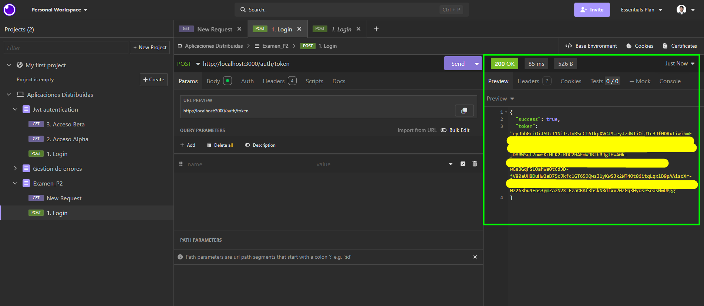
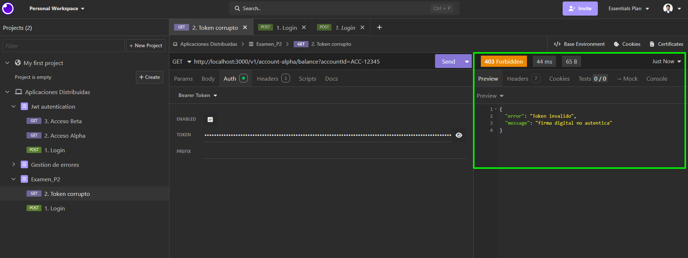
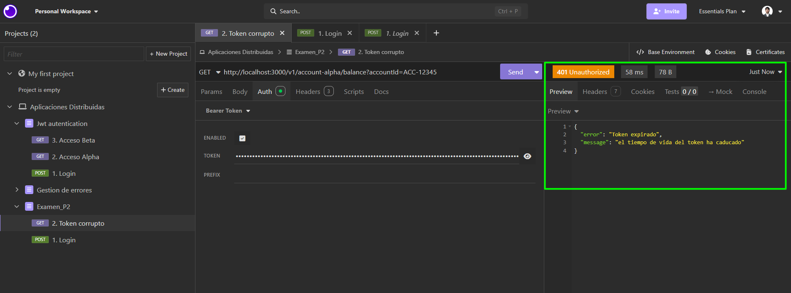
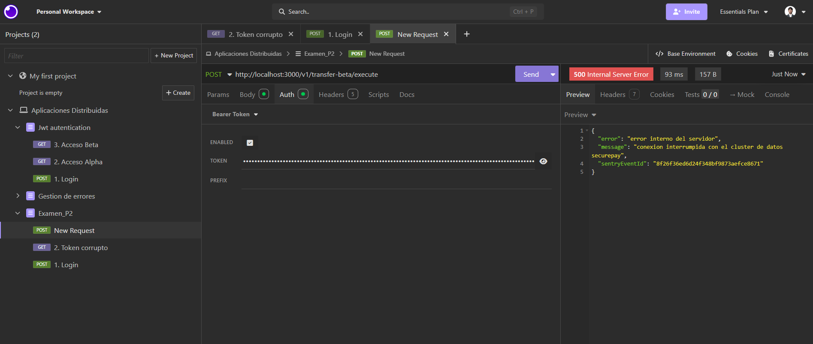

# Examen de Aplicaciones Distribuidas

* **Institución:** Universidad de las Fuerzas Armadas ESPE
* **Carrera:** Ingeniería de Software
* **Estudiante:** Moisés Benalcázar

---

# Evidencias de Postman (Autenticación y Accesos)

## 1. Generación del Token y Acceso Válido (200 OK)

Muestra la petición exitosa usando un Bearer Token válido y con tiempo de expiración correcto.

### Captura de Pantalla

---

## 2. Token Malformado o Inválido (403 Forbidden)

Muestra la respuesta del sistema ante un token alterado de forma maliciosa.

### Captura de Pantalla

---

## 3. Token Expirado después de 2 minutos (401 Unauthorized)

Muestra el control de excepción lógica cuando el ciclo de vida de los 2 minutos obligatorios ha caducado.

### Captura de Pantalla

---

# Evidencias de Sentry APM (Error Tracking)

## 4. Registro de Alerta de Error Operacional 500

Captura de pantalla de la bandeja de problemas (**Issues**) de Sentry mostrando el impacto de la caída de la base de datos distribuida.

### Captura de Pantalla

---

## 5. Telemetría de Contexto y Tags de Usuario Afectado

Captura detallada donde se evidencia que Sentry guardó con éxito los metadatos `affected_user_id` y los datos del usuario extraídos de forma automática desde el JWT.

### Captura de Pantalla

---